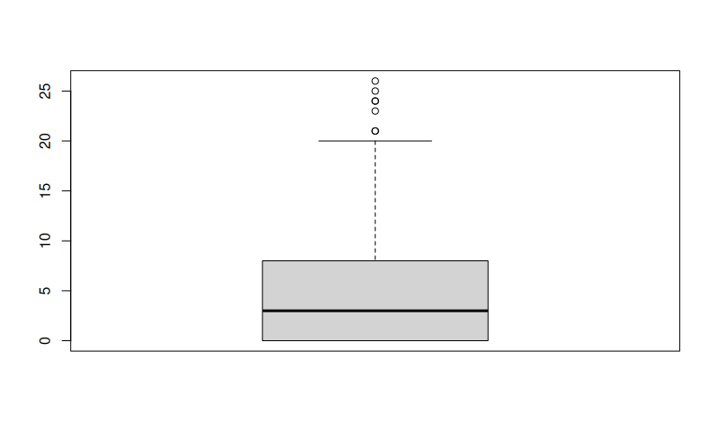
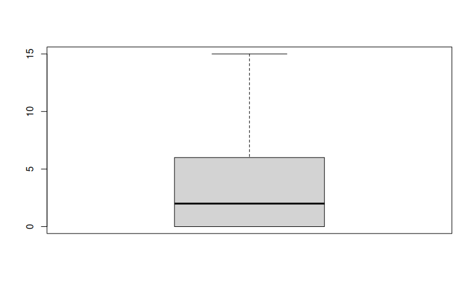
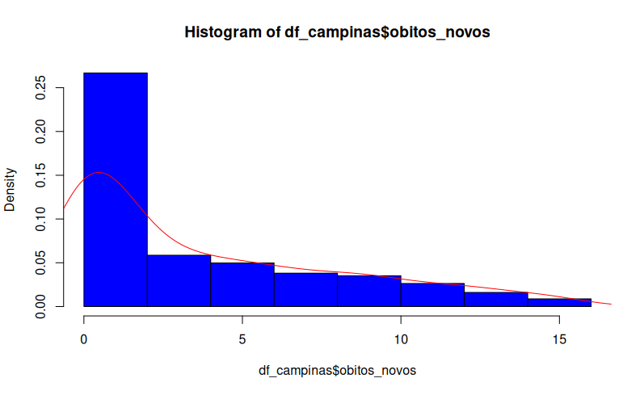
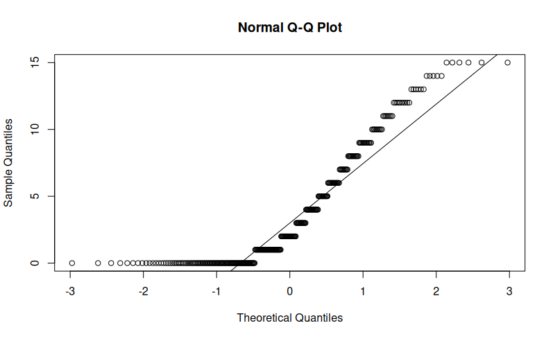
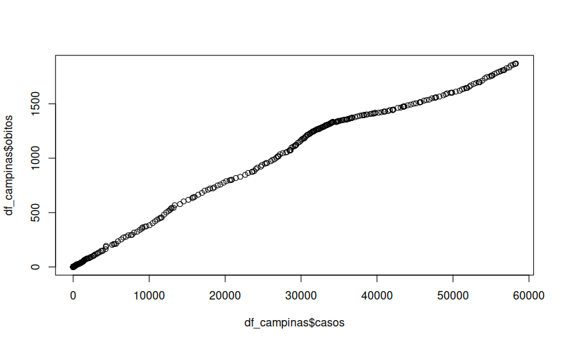
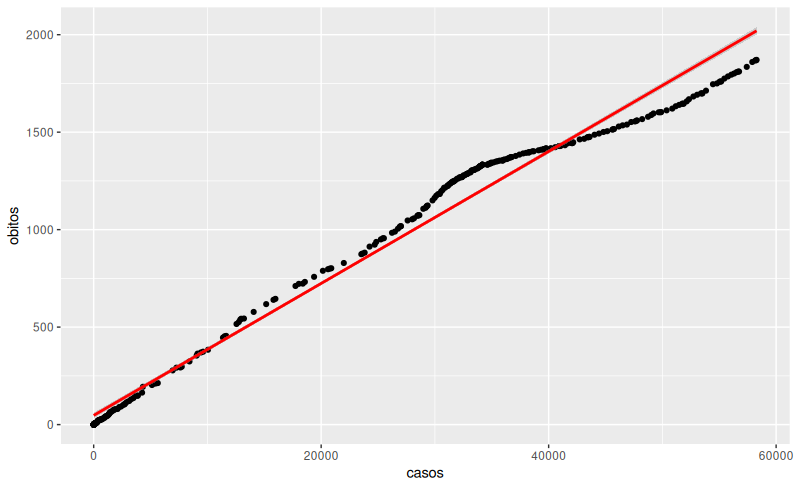

**Some analyses on the COVID-19 database for the city of São Paulo: Discrepancies, outliers, and new deaths.**

First, after thorough data cleaning, we analyze the new deaths in São Paulo using a boxplot to identify significant discrepancies in this variable. This approach helps us begin to understand the concepts of outliers, mean, median, and quartiles in a more visual way.

After that, I cleaned the outliers by removing all data below the lower limit and above the upper limit, resulting in the following representation:

**Normality Tests**

By analyzing the variable for new deaths, we aim to determine whether it is a normally distributed symmetric variable, a crucial criterion for many other functions.

By examining the histogram, it is clear that the data does not follow a normal distribution. It does not adhere to the rules of standard deviation or median, nor does the curve form a bell shape. Additionally, I used qqnorm and qqline to assess normality, ensuring to check if the points align with the reference line.

**Correlation and Linear Regression**

After several analyses, I aimed to develop a linear regression model to explore the relationship between cases and deaths. I checked the normality of both variables and plotted the line graph for this relationship. While the data does not exhibit normality, linearity is evident.

Thus, I used the Spearman correlation method, suitable for a large set of non- parametricdata,resultinginacase-deathcorrelationof99.967%,whichisnearlyperfect.

From there, I used the lm function in R to calculate the regression coefficients. Using these coefficients, I constructed the regression function, achieving an R² (or accuracy) of 98% for the regression. Afterward, I employed ggplot to visualize the regression line (in red) and the case-death points (as dots), confirming the accuracy of the performed regression.

Afterward, I created a function to calculate, for each city, the number of deaths expected for a given number of cases using the linear regression model. The implementation is shown in the code below.

**death\_regression\_function\_city** <- function(city, cases) {

**regression\_df** <- df %>% filter(municipality == city) regression <- lm(formula = deaths ~ cases, data = regression\_df) coefficients <- regression$coefficients

calculation <- coefficients[2] \* cases + coefficients[1]

r\_squared <- summary(regression)$r.squared

return(sprintf(**"%.2f deaths with an accuracy of %.4f%%"**, calculation, (r\_squared \* 100))) }

death\_regression\_function\_city(**"Campinas"**, 60000)
